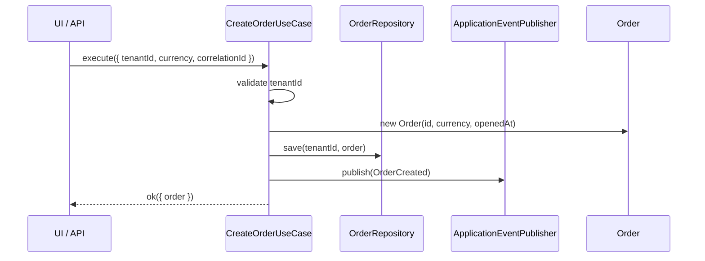
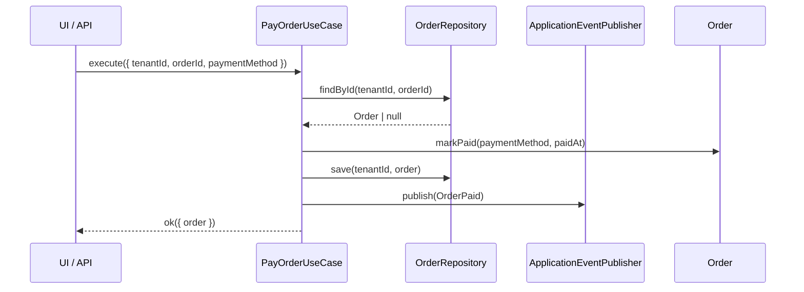
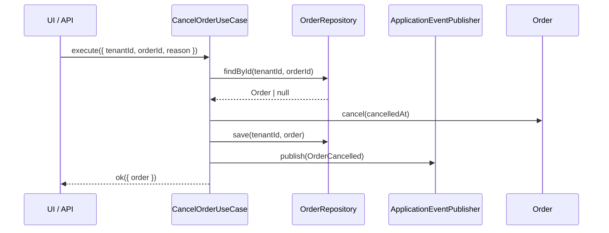
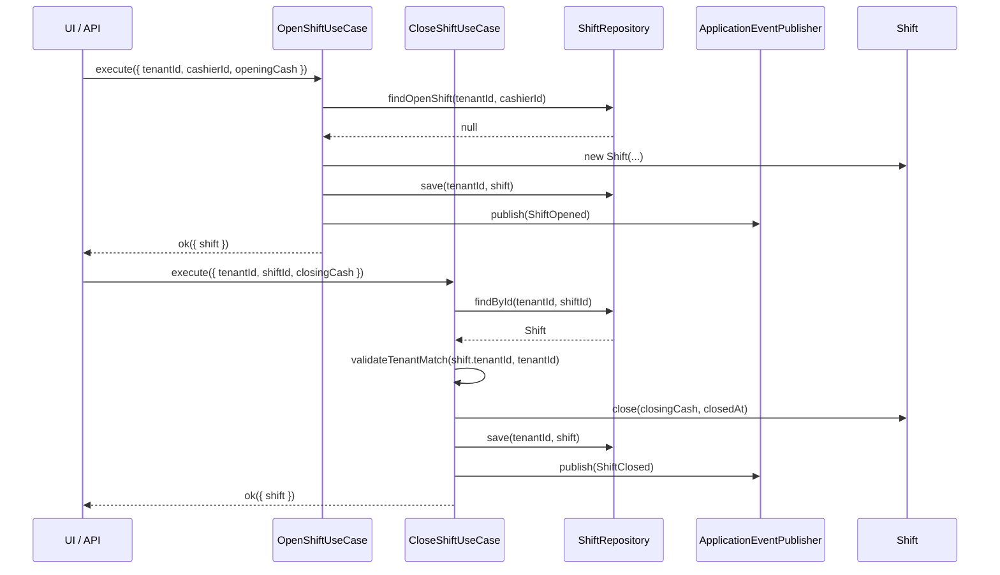
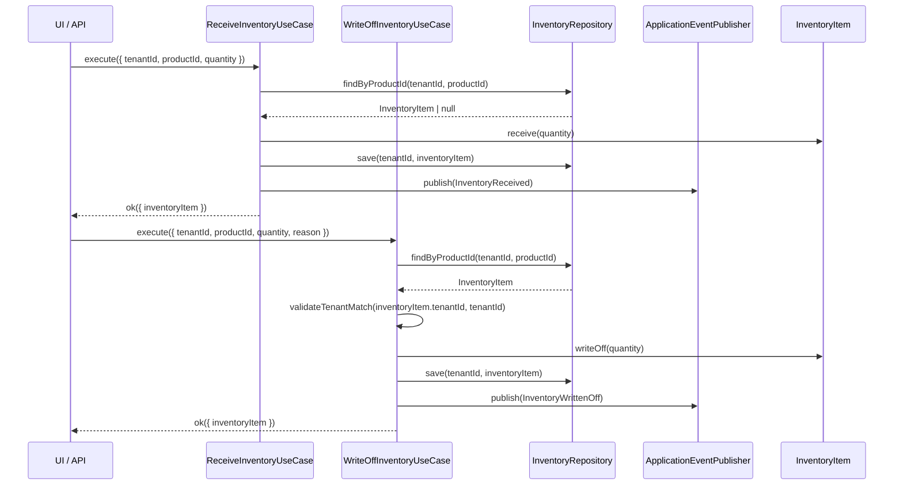

# CONTROL OS Application Layer

The application layer is the command/use-case boundary for CONTROL OS. It orchestrates tenant-scoped business workflows, delegates rules to domain entities, and depends only on ports and repository interfaces.

It does not import Supabase clients, SQL builders, React, route handlers, or infrastructure adapters.

## Folder Structure

```text
src/application/
+-- dtos/
|   +-- common-dtos.ts
|   +-- inventory-dtos.ts
|   +-- order-dtos.ts
|   +-- shift-dtos.ts
+-- ports/
|   +-- application-event-publisher.ts
|   +-- clock.ts
|   +-- id-generator.ts
+-- repositories/
|   +-- inventory-repository.ts
|   +-- order-repository.ts
|   +-- product-repository.ts
|   +-- shift-repository.ts
+-- use-cases/
|   +-- add-order-item-use-case.ts
|   +-- cancel-order-use-case.ts
|   +-- close-shift-use-case.ts
|   +-- create-order-use-case.ts
|   +-- index.ts
|   +-- open-shift-use-case.ts
|   +-- pay-order-use-case.ts
|   +-- receive-inventory-use-case.ts
|   +-- remove-order-item-use-case.ts
|   +-- use-case.ts
|   +-- write-off-inventory-use-case.ts
+-- index.ts
+-- result.ts
+-- validation.ts
```

## Boundary Rules

- UI, API routes, jobs, and subscribers call use cases.
- Use cases return `Result<T>` and do not throw expected business errors.
- Use cases depend on repository interfaces and ports only.
- Repositories receive `tenantId` on every read and write.
- Domain entities enforce business rules and expose snapshots for persistence/API mapping.
- Infrastructure owns Supabase, PostgreSQL, RLS policies, transactions, event adapters, and generated IDs.

## Implemented MVP Use Cases

| Module | Use case | Status | Primary event |
| --- | --- | --- | --- |
| POS | `CreateOrderUseCase` | Implemented | `OrderCreated` |
| POS | `AddOrderItemUseCase` | Implemented | none |
| POS | `RemoveOrderItemUseCase` | Implemented | none |
| POS | `PayOrderUseCase` | Implemented | `OrderPaid` |
| POS | `CancelOrderUseCase` | Implemented | `OrderCancelled` |
| Shifts | `OpenShiftUseCase` | Implemented | `ShiftOpened` |
| Shifts | `CloseShiftUseCase` | Implemented | `ShiftClosed` |
| Inventory | `ReceiveInventoryUseCase` | Implemented | `InventoryReceived` |
| Inventory | `WriteOffInventoryUseCase` | Implemented | `InventoryWrittenOff` |

## Defined MVP Backlog

These use cases belong in the MVP product boundary, but need domain models and repositories before implementation:

| Module | Use case |
| --- | --- |
| Employee Management | `CreateEmployee`, `UpdateEmployeeRole`, `DeactivateEmployee`, `AssignEmployeeToLocation` |
| Control Score Engine | `RecalculateControlScore`, `RecordControlSignal`, `GetControlScoreSnapshot` |
| Fraud Detection | `EvaluateOrderRisk`, `CreateFraudIncident`, `ResolveFraudIncident` |
| AI Summary Engine | `GenerateDailySummary`, `GenerateShiftSummary`, `GetSummaryHistory` |

## Core Interfaces

```ts
export interface UseCase<TInput, TOutput> {
  execute(input: TInput): Promise<Result<TOutput>>;
}

export interface OrderRepository {
  findById(tenantId: string, orderId: string): Promise<Order | null>;
  save(tenantId: string, order: Order): Promise<void>;
}

export interface ShiftRepository {
  findOpenShift(tenantId: string, cashierId: string): Promise<Shift | null>;
  findById(tenantId: string, shiftId: string): Promise<Shift | null>;
  save(tenantId: string, shift: Shift): Promise<void>;
}

export interface InventoryRepository {
  findByProductId(tenantId: string, productId: string): Promise<InventoryItem | null>;
  save(tenantId: string, inventoryItem: InventoryItem): Promise<void>;
}

export interface ApplicationEventPublisher {
  publish<TName extends EventName>(event: ApplicationEvent<TName>): Promise<void>;
  publishAll(events: ApplicationEvent[]): Promise<void>;
}
```

## Tenant Isolation

Every command input includes `tenantId`. Use cases validate it, trim it, and pass it to every repository call. Aggregates that carry `tenantId` themselves, such as `Shift` and `InventoryItem`, are defensively checked after reads with `validateTenantMatch`.

Infrastructure must still enforce tenant isolation with:

- PostgreSQL RLS policies on every tenant-owned table.
- Tenant predicates in repository queries.
- Tenant-scoped unique indexes, for example `(tenant_id, cashier_id)` for open shifts.
- A transactional outbox table that includes `tenant_id`.

## Sequence Diagrams

### CreateOrder



### PayOrder



### CancelOrder



### Shift Lifecycle



### Inventory Movement



## Wiring Example

```ts
import {
  CreateOrderUseCase,
  PayOrderUseCase,
  type ApplicationEventPublisher,
  type Clock,
  type IdGenerator,
  type OrderRepository
} from "@/application";

const orderRepository: OrderRepository = /* Supabase adapter */;
const idGenerator: IdGenerator = /* UUID adapter */;
const clock: Clock = /* system or test clock */;
const eventPublisher: ApplicationEventPublisher = /* outbox adapter */;

const createOrder = new CreateOrderUseCase({
  orderRepository,
  idGenerator,
  clock,
  eventPublisher
});

const payOrder = new PayOrderUseCase({
  orderRepository,
  clock,
  eventPublisher
});

const created = await createOrder.execute({
  tenantId: "tenant_123",
  currency: "USD",
  correlationId: "req_123"
});

if (!created.ok) {
  throw new Error(created.error.message);
}

await payOrder.execute({
  tenantId: "tenant_123",
  orderId: created.value.order.id,
  paymentMethod: "cash",
  correlationId: "req_123"
});
```

## Production Recommendations

- Implement `ApplicationEventPublisher` as a transactional outbox writer first. A separate worker can adapt outbox rows into `src/events` envelopes and publish through NATS.
- Keep Supabase repositories in infrastructure folders only. They should hydrate domain entities and never leak database row shapes into use cases.
- Add optimistic concurrency to mutable aggregates with a `version` column before high-volume POS rollout.
- Add idempotency keys for payment, inventory receive, and write-off commands.
- Add command-level authorization outside the use case boundary, then pass only the authorized `tenantId` and actor context into the command.
- Add integration tests for RLS policies and unit tests for each use case using in-memory repository fakes.
