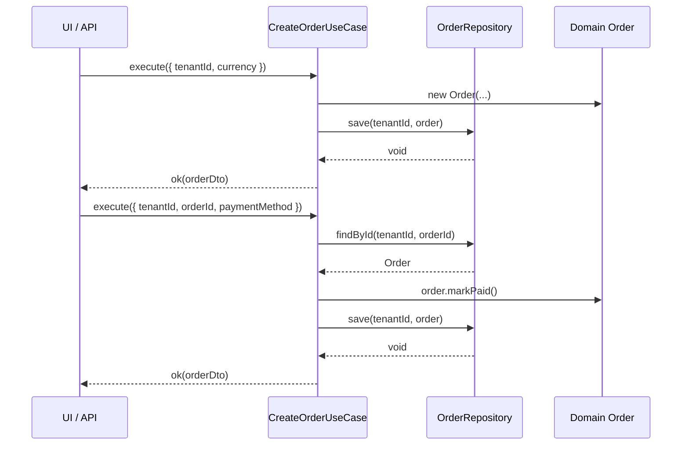
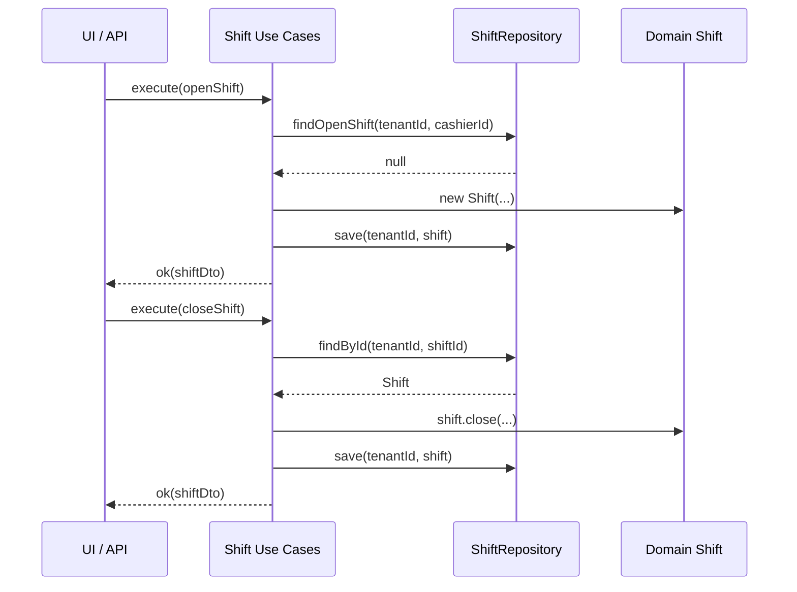
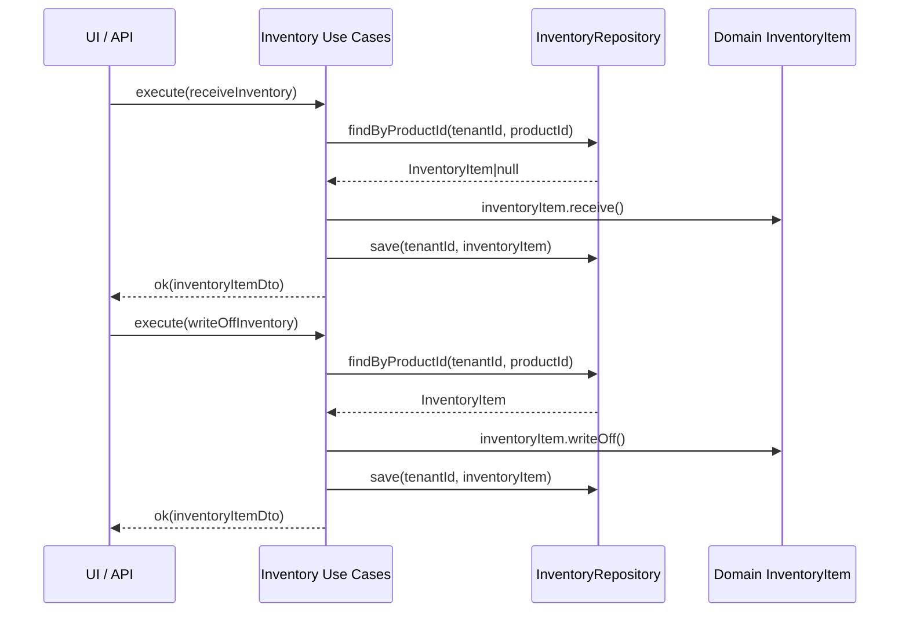

# Application Layer

CONTROL OS uses Clean Architecture boundaries:

```text
src/application/
+-- dtos/
|   +-- order-dtos.ts
+-- ports/
|   +-- id-generator.ts
+-- repositories/
|   +-- order-repository.ts
|   +-- product-repository.ts
+-- use-cases/
|   +-- add-order-item-use-case.ts
|   +-- cancel-order-use-case.ts
|   +-- create-order-use-case.ts
|   +-- pay-order-use-case.ts
|   +-- open-shift-use-case.ts
|   +-- close-shift-use-case.ts
|   +-- receive-inventory-use-case.ts
|   +-- write-off-inventory-use-case.ts
|   +-- index.ts
|   +-- remove-order-item-use-case.ts
+-- index.ts
+-- result.ts
```

## Rules

- UI calls use cases.
- Use cases orchestrate business actions.
- Use cases depend on repository interfaces only.
- Domain entities enforce business rules.
- Infrastructure implements the repository interfaces later.
- No Supabase imports belong in `src/application`.

## Example Usage

```ts
import {
  AddOrderItemUseCase,
  CancelOrderUseCase,
  CloseShiftUseCase,
  CreateOrderUseCase,
  OpenShiftUseCase,
  PayOrderUseCase,
  ReceiveInventoryUseCase,
  RemoveOrderItemUseCase,
  WriteOffInventoryUseCase,
  type IdGenerator,
  type InventoryRepository,
  type OrderRepository,
  type ProductRepository,
  type ShiftRepository
} from "@/application";

const orderRepository: OrderRepository = /* infrastructure implementation */;
const productRepository: ProductRepository = /* infrastructure implementation */;
const idGenerator: IdGenerator = /* infrastructure implementation */;

const createOrder = new CreateOrderUseCase({
  orderRepository,
  idGenerator
});

const addOrderItem = new AddOrderItemUseCase({
  orderRepository,
  productRepository
});

const removeOrderItem = new RemoveOrderItemUseCase({
  orderRepository
});

const cancelOrder = new CancelOrderUseCase({
  orderRepository
});

const created = await createOrder.execute({ currency: "USD" });

if (!created.ok) {
  throw new Error(created.error.message);
}

await addOrderItem.execute({
  orderId: created.value.order.id,
  productId: "product_123",
  quantity: 2
});

await removeOrderItem.execute({
  orderId: created.value.order.id,
  productId: "product_123",
  quantity: 1
});

await cancelOrder.execute({
  orderId: created.value.order.id
});
```

## Tenant-aware Application Layer

Use cases depend only on repository interfaces and tenant identifiers. This keeps business orchestration independent from Supabase, PostgreSQL, or any infrastructure details.

### Tenant Isolation Pattern
- Each use case receives `tenantId` in its input DTO.
- Repository interfaces accept `tenantId` for every entity operation.
- No direct database queries occur inside the application layer.
- Domain entities enforce business rules, while repositories enforce access boundaries and row-level isolation.

## Sequence Diagrams

### CreateOrder / PayOrder



### Shift Lifecycle



### Inventory Receive / Write-off



## Result Pattern

Use cases return:

```ts
type Result<T> =
  | { ok: true; value: T }
  | { ok: false; error: ApplicationError };
```

Callers should branch on `result.ok`; use cases do not throw expected business errors.
