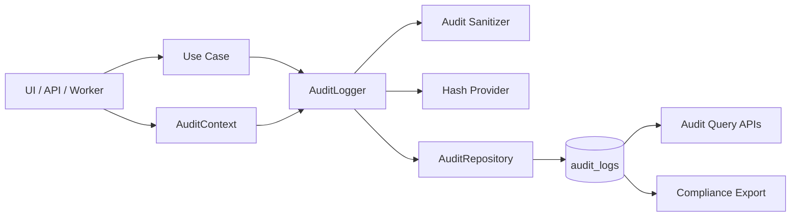

# CONTROL OS Audit Foundation

The audit foundation provides tenant-scoped, append-only traceability for enterprise operations. It answers:

- Who performed the action
- What action was performed
- When it happened
- Which tenant was affected
- Which resource changed
- What the previous and new values were
- Which device, IP, session, request, and correlation id were involved

## Architecture



Code entry points:

- `src/audit/types.ts`: action taxonomy, resource types, query contracts
- `src/audit/audit-context.ts`: actor, device, IP, request, and correlation context
- `src/audit/audit-sanitizer.ts`: secret/card/token redaction
- `src/audit/audit-hash.ts`: SHA-256 tamper-evidence provider
- `src/audit/audit-logger.ts`: validation, sanitization, hash, append write
- `src/audit/supabase-audit-repository.ts`: Supabase/PostgreSQL adapter

## Coverage

The taxonomy covers:

| Area | Example actions |
| --- | --- |
| Orders | `order.created`, `order.updated`, `order.cancelled`, `order.paid`, `order.refunded` |
| Payments | `payment.created`, `payment.captured`, `payment.failed`, `payment.refunded` |
| Inventory | `inventory.received`, `inventory.adjusted`, `inventory.written_off`, `inventory.counted` |
| Employees | `employee.created`, `employee.updated`, `employee.deactivated`, `employee.role_assigned` |
| Permissions | `permission.granted`, `permission.revoked`, `permission.role_created`, `permission.role_updated` |
| Pricing | `pricing.created`, `pricing.updated`, `pricing.deleted` |
| Discounts | `discount.created`, `discount.updated`, `discount.applied`, `discount.removed`, `discount.disabled` |
| Refunds | `refund.created`, `refund.approved`, `refund.rejected`, `refund.completed` |

Supporting audit actions also cover shifts, control score updates, AI summaries, and audit log access/export.

## Database Schema

Base table plus hardening migration:

```sql
create table if not exists audit_logs (
  id uuid primary key,
  tenant_id text not null,
  user_id text not null,
  actor_type text not null default 'user',
  actor_display_name text,
  action text not null,
  resource_type text not null,
  resource_id text,
  outcome text not null default 'success',
  occurred_at timestamptz not null,
  previous_value jsonb,
  new_value jsonb,
  reason text,
  metadata jsonb,
  ip_address text,
  forwarded_for text,
  user_agent text,
  device_info text,
  correlation_id text,
  causation_id text,
  request_id text,
  session_id text,
  source text,
  sensitivity text not null default 'confidential',
  hash text,
  hash_algorithm text,
  created_at timestamptz not null default now(),
  constraint audit_logs_actor_type_check
    check (actor_type in ('user', 'system', 'service', 'api_key')),
  constraint audit_logs_outcome_check
    check (outcome in ('success', 'failure', 'denied')),
  constraint audit_logs_sensitivity_check
    check (sensitivity in ('internal', 'confidential', 'restricted'))
);
```

Append-only enforcement:

```sql
create or replace function prevent_audit_logs_update_delete()
returns trigger
language plpgsql
as $$
begin
  raise exception 'audit_logs is append-only';
end;
$$;

create trigger audit_logs_no_update_delete
before update or delete on audit_logs
for each row
execute function prevent_audit_logs_update_delete();
```

RLS shape:

```sql
alter table audit_logs enable row level security;

create policy audit_logs_tenant_select
  on audit_logs
  for select
  using (tenant_id = current_setting('app.current_tenant_id', true));

create policy audit_logs_tenant_insert
  on audit_logs
  for insert
  with check (tenant_id = current_setting('app.current_tenant_id', true));
```

## Index Strategy

Primary indexes:

```sql
create index audit_logs_tenant_occurred_id_idx
  on audit_logs (tenant_id, occurred_at desc, id desc);

create index audit_logs_tenant_action_idx
  on audit_logs (tenant_id, action);

create index audit_logs_tenant_resource_idx
  on audit_logs (tenant_id, resource_type, resource_id);

create index audit_logs_tenant_user_idx
  on audit_logs (tenant_id, user_id);

create index audit_logs_tenant_correlation_idx
  on audit_logs (tenant_id, correlation_id);

create index audit_logs_tenant_request_idx
  on audit_logs (tenant_id, request_id);

create index audit_logs_metadata_gin_idx
  on audit_logs using gin (metadata jsonb_path_ops);

create index audit_logs_occurred_at_brin_idx
  on audit_logs using brin (occurred_at);
```

Strategy:

- Always lead operational indexes with `tenant_id`.
- Use `(tenant_id, occurred_at desc, id desc)` for default timeline views.
- Use `(tenant_id, resource_type, resource_id)` for resource history.
- Use `(tenant_id, correlation_id)` and `(tenant_id, request_id)` for incident tracing.
- Use BRIN on `occurred_at` for long-term append-only storage.
- Use GIN JSON indexes sparingly; prefer typed columns for frequent filters.

## Query Strategy

Repository contract:

```ts
export interface AuditRepository {
  save(record: AuditRecord): Promise<void>;
  saveMany(records: AuditRecord[]): Promise<void>;
  findById(tenantId: string, auditId: string): Promise<AuditRecord | null>;
  query(filters: AuditQueryFilters): Promise<AuditQueryResult>;
}
```

Query rules:

- Every query must include `tenantId`.
- Prefer exact filters: `userId`, `action`, `resourceType`, `resourceId`, `outcome`.
- Use `correlationId`, `requestId`, and `sessionId` for investigation trails.
- Use bounded `limit`; repository clamps to a safe maximum.
- Sort by `occurred_at desc, id desc`.
- For high-volume tenants, move from offset pagination to keyset pagination using `(occurred_at, id)`.
- Audit access itself should create `audit.viewed` or `audit.exported` records.

## Implementation Example

```ts
import { AuditLogger, Sha256AuditHashProvider, SupabaseAuditRepository } from "@/audit";

const auditLogger = new AuditLogger({
  auditRepository: new SupabaseAuditRepository(supabase),
  idGenerator,
  hashProvider: new Sha256AuditHashProvider()
});

await auditLogger.log(
  {
    tenantId: "tenant_abc",
    userId: "user_123",
    actorType: "user",
    actorDisplayName: "Store Manager",
    correlationId: "corr_321",
    requestId: "req_987",
    sessionId: "sess_555",
    ipAddress: "203.0.113.10",
    forwardedFor: "203.0.113.10",
    userAgent: "Mozilla/5.0",
    deviceInfo: "Chrome on Windows",
    source: "controlos.web"
  },
  {
    action: "order.paid",
    resourceType: "order",
    resourceId: "order_789",
    previousValue: { status: "open" },
    newValue: { status: "paid", paymentId: "payment_456" },
    metadata: { complianceTags: ["payment", "pos"] }
  }
);
```

More examples live in `src/audit/example-audit-usage.ts`.

## Sample Audit Records

Order payment:

```json
{
  "id": "7e58f7d3-9a7e-4c2d-8fa6-1f4b0dee37c2",
  "tenantId": "tenant_abc",
  "userId": "user_123",
  "actorType": "user",
  "actorDisplayName": "Store Manager",
  "action": "order.paid",
  "resourceType": "order",
  "resourceId": "order_789",
  "outcome": "success",
  "occurredAt": "2026-06-22T12:18:23.456Z",
  "previousValue": { "status": "open" },
  "newValue": { "status": "paid", "paymentId": "payment_456" },
  "ipAddress": "203.0.113.10",
  "userAgent": "Mozilla/5.0",
  "deviceInfo": "Chrome on Windows",
  "correlationId": "corr_321",
  "requestId": "req_987",
  "sensitivity": "confidential",
  "hashAlgorithm": "SHA-256"
}
```

Permission change:

```json
{
  "tenantId": "tenant_abc",
  "userId": "admin_001",
  "action": "permission.granted",
  "resourceType": "permission",
  "resourceId": "employee_456",
  "outcome": "success",
  "previousValue": { "permission": "inventory.write", "enabled": false },
  "newValue": { "permission": "inventory.write", "enabled": true },
  "metadata": { "complianceTags": ["access-control"] },
  "sensitivity": "restricted"
}
```

Inventory write-off:

```json
{
  "tenantId": "tenant_abc",
  "userId": "manager_123",
  "action": "inventory.written_off",
  "resourceType": "inventory",
  "resourceId": "inv_999",
  "reason": "Expired stock",
  "previousValue": { "productId": "prod_1", "availableQuantity": 25 },
  "newValue": { "productId": "prod_1", "availableQuantity": 20 },
  "metadata": { "complianceTags": ["inventory", "loss-control"] }
}
```

## Retention Policy

Recommended default:

- 0-12 months: hot PostgreSQL storage, fully queryable.
- 12-36 months: warm storage, partitioned/compressed, queryable for investigations.
- 36+ months: cold object storage with signed export manifests.

Controls:

- Support tenant-specific legal hold.
- Do not delete audit rows through normal application paths.
- Use append-only triggers for online tables.
- Export before purge and retain export hash manifests.
- Document retention per region and contract.

## Compliance Recommendations

- Enforce RLS and tenant-scoped repository queries.
- Restrict audit access with least-privilege roles.
- Log audit reads and exports with `audit.viewed` and `audit.exported`.
- Sanitize secrets, tokens, passcodes, card numbers, CVV/CVC, and API keys.
- Hash records with SHA-256 for tamper evidence.
- Encrypt database storage and backups.
- Include correlation/request/session ids in every command context.
- Mask or suppress restricted fields in UI based on viewer role.
- Alert on denied permission changes, repeated payment failures, and abnormal write-offs.
- Run periodic reconciliation between domain events and audit logs.

## Operational Notes

- Audit writes should happen inside the same transaction as the business change when possible.
- If audit write fails for sensitive actions, fail closed unless an approved break-glass path exists.
- For async/event-driven audit logs, include the originating event id in metadata.
- Treat audit logs as compliance data, not analytics data; analytics projections should copy only approved fields.
