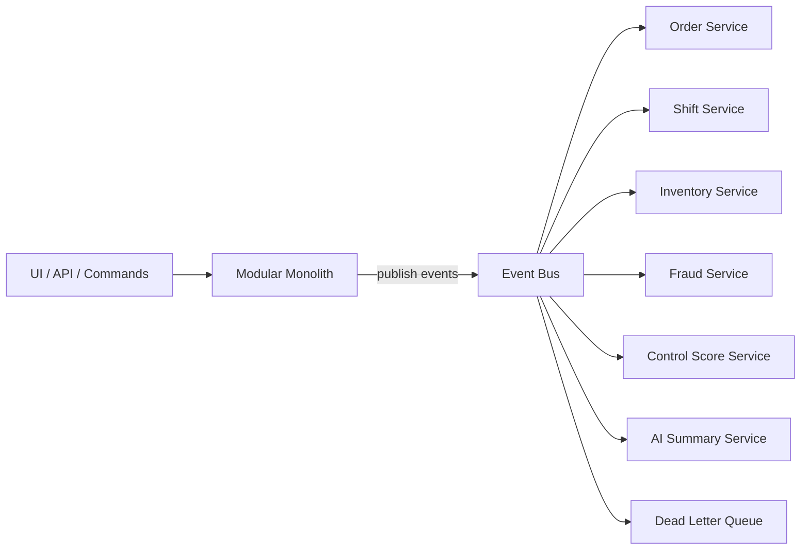

# CONTROL OS Event Foundation

## Overview
CONTROL OS is built as an Event Driven Architecture foundation designed for a staged evolution from Modular Monolith → Distributed Services → Microservices.

This event foundation is NATS-compatible and built for horizontal scalability, tenant isolation, and reliable delivery.

## Domain Events
The core domain events are:
- `OrderCreated`
- `OrderPaid`
- `OrderCancelled`
- `ShiftOpened`
- `ShiftClosed`
- `InventoryReceived`
- `InventoryWrittenOff`
- `FraudDetected`
- `ControlScoreUpdated`
- `AISummaryGenerated`

Each event is defined in `src/events/contracts.ts` with a strict payload contract and a common event envelope.

## Event Envelope
All domain events share a standard envelope:

```ts
export type DomainEvent<T extends EventName = EventName> = {
  eventId: string;
  eventName: T;
  eventVersion: number;
  occurredAt: string;
  tenantId: string;
  aggregateId: string;
  correlationId?: string;
  causationId?: string;
  source?: string;
  payload: EventPayloadMap[T];
};
```

This ensures:
- immutable event metadata
- tenant isolation via `tenantId`
- versioned evolution through `eventVersion`
- traceability through `aggregateId`, `correlationId`, `causationId`

## Subject Naming
Subjects are namespaced under `controlos.events`.

Examples:
- `controlos.events.OrderCreated`
- `controlos.events.OrderPaid`
- `controlos.events.OrderCancelled`
- `controlos.events.ShiftOpened`
- `controlos.events.ShiftClosed`
- `controlos.events.InventoryReceived`
- `controlos.events.InventoryWrittenOff`
- `controlos.events.FraudDetected`
- `controlos.events.ControlScoreUpdated`
- `controlos.events.AISummaryGenerated`

## Event Bus Architecture
The event bus abstraction is implemented in `src/events/event-bus.ts`.

### Key concepts
- `EventBus`: publisher/subscriber contract
- `EventHandler`: typed event handler callback
- `EventSubscription`: unsubscribe handle
- `SubscriberOptions`: queue group, durable subscription, retry hints

### Current bus implementations
- `InMemoryEventBus` for local development and modular-monolith execution
- `NatsEventBus` scaffold in `src/events/nats-adapter.ts` for NATS compatibility

## Event schema definitions
Event schemas are defined in `src/events/contracts.ts` with JSON object shapes for each payload.

Example schema for `OrderCreated`:

```json
{
  "type": "object",
  "properties": {
    "tenantId": { "type": "string" },
    "orderId": { "type": "string" },
    "status": { "type": "string" },
    "total": { "type": "object" },
    "currency": { "type": "string" },
    "createdAt": { "type": "string", "format": "date-time" }
  },
  "required": ["tenantId", "orderId", "status", "total", "currency", "createdAt"],
  "additionalProperties": false
}
```

## Publisher example
Use the event factory and bus to publish domain events.

```ts
import { createEvent, type DomainEvent } from "@/events";
import type { EventBus } from "@/events";

async function publishOrderCreated(bus: EventBus, tenantId: string, orderId: string) {
  const event: DomainEvent<"OrderCreated"> = createEvent({
    eventName: "OrderCreated",
    tenantId,
    aggregateId: orderId,
    payload: {
      orderId,
      tenantId,
      status: "open",
      total: { amount: 1500, currency: "USD" },
      currency: "USD",
      createdAt: new Date().toISOString()
    }
  });

  await bus.publish(event);
}
```

### Example publisher file
See `src/events/example-publishers.ts`.

## Subscriber example
Subscribe to domain events with an idempotent handler.

```ts
import type { EventBus } from "@/events";

async function subscribeOrderCreated(bus: EventBus) {
  return bus.subscribe(
    "OrderCreated",
    async (event) => {
      console.log("Order created", event.payload.orderId);
      // apply side effects, update read model, trigger downstream process
    },
    {
      queueGroup: "order-service",
      durableName: "order-created",
      maxRetries: 5,
      retryDelayMs: 1000
    }
  );
}
```

### Example subscriber file
See `src/events/example-subscribers.ts`.

## Retry strategy
Local bus retry strategy in `InMemoryEventBus`:
- default `maxRetries = 3`
- default `retryDelayMs = 500`

Subscriber behavior:
- transient failures should be retried
- validation or schema errors should be treated as non-retryable
- implement idempotent subscriber handlers to tolerate duplicates

## Dead Letter Queue strategy
DLQ is mandatory for production reliability.

Recommended strategy:
- configure NATS JetStream consumer with `max_deliver`
- on exhaustion, move the message to `controlos.dlq` or `controlos.dlq.<eventName>`
- include failure metadata:
  - `eventId`
  - `subject`
  - `tenantId`
  - `attempts`
  - `lastError`
  - `failedAt`

DLQ consumers can trigger alerting, manual investigation, or replay workflows.

## Horizontal scalability
Design principles:
- multiple subscribers may join the same queue group for scaling
- use durable JetStream consumers for stateful recovery
- partition by tenant or aggregate for stateful workloads
- keep handlers stateless and idempotent
- avoid global locks inside event consumers

## Future microservice migration plan
1. Keep event contracts stable and versioned.
2. Use the modular monolith with `InMemoryEventBus` for initial development.
3. Introduce shared NATS JetStream in the platform bootstrap.
4. Split services around bounded contexts:
   - Order Service
   - Shift Service
   - Inventory Service
   - Fraud Service
   - Control Score Service
   - AI Summary Service
5. Replace repository persistence with service-to-service or event-sourced aggregates.
6. Add schema registry or validation service for published payloads.
7. Deploy service-specific consumers with queue groups and DLQ routing.
8. Evolve toward isolated microservices with clear event contracts and stable subjects.

## Architecture diagram

