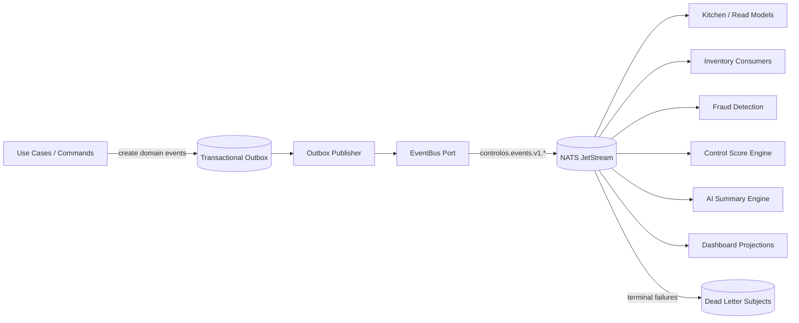

# CONTROL OS Event Foundation

CONTROL OS uses an event-driven foundation that can run inside the modular monolith today and move to NATS JetStream-backed distributed services later.

Roadmap:

```text
Monolith -> Modular Monolith -> Distributed Services -> Microservices
```

## Architecture



During modular-monolith execution, `InMemoryEventBus` gives the same publisher/subscriber shape without requiring NATS. In production, `NatsEventBus` publishes versioned CloudEvents-compatible messages to JetStream.

## Subject Model

Subjects are versioned so future contracts can migrate without breaking old consumers.

```text
controlos.events.v1.OrderCreated
controlos.events.v1.OrderPaid
controlos.events.v1.OrderCancelled
controlos.events.v1.ShiftOpened
controlos.events.v1.ShiftClosed
controlos.events.v1.InventoryReceived
controlos.events.v1.InventoryWrittenOff
controlos.events.v1.FraudDetected
controlos.events.v1.ControlScoreUpdated
controlos.events.v1.AISummaryGenerated
```

Dead letter subjects:

```text
controlos.dlq.v1.<EventName>
controlos.dlq.v1.InvalidEvent
```

NATS stream scaffold:

```ts
export const NATS_EVENT_STREAM_CONFIG = {
  name: "CONTROL_OS_EVENTS",
  subjects: ["controlos.events.v1.>"],
  retention: "limits",
  storage: "file",
  discard: "old",
  duplicateWindowMs: 120_000
};
```

## Event Envelope

All domain events use this envelope:

```ts
export type DomainEvent<T extends EventName = EventName> = {
  eventId: string;
  eventName: T;
  eventVersion: number;
  occurredAt: string;
  tenantId: string;
  aggregateId: string;
  correlationId?: string;
  causationId?: string;
  source?: string;
  metadata?: Record<string, string | number | boolean | null>;
  payload: EventPayloadMap[T];
};
```

Envelope rules:

- `tenantId` is mandatory and must match `payload.tenantId`.
- `eventId` is the idempotency key for consumers.
- `aggregateId` is the owning aggregate id.
- `correlationId` traces a business workflow.
- `causationId` links an event to the command or event that caused it.
- `eventVersion` is fixed at `1` for the current contract set.

## Domain Events

| Event | Producer | Aggregate | Primary Consumers |
| --- | --- | --- | --- |
| `OrderCreated` | POS | order | Kitchen, Inventory, Fraud, Analytics |
| `OrderPaid` | POS | order | Shift, Fraud, Control Score, Analytics |
| `OrderCancelled` | POS | order | Inventory, Fraud, Analytics |
| `ShiftOpened` | Employee Management | shift | POS, Control Score, Analytics |
| `ShiftClosed` | Employee Management | shift | Control Score, AI Summary, Analytics |
| `InventoryReceived` | Inventory | inventory | Control Score, Analytics |
| `InventoryWrittenOff` | Inventory | inventory | Fraud, Control Score, Analytics |
| `FraudDetected` | Fraud Detection | fraud incident | Control Score, AI Summary, Notifications |
| `ControlScoreUpdated` | Control Score | control score | Dashboard, AI Summary, Analytics |
| `AISummaryGenerated` | AI Summary | AI summary | Dashboard, Notifications |

## Schema Definitions

Schemas live in [contracts.ts](../src/events/contracts.ts) as `EVENT_SCHEMAS` and `EVENT_CONTRACTS`.

Example:

```ts
OrderPaid: {
  type: "object",
  properties: {
    tenantId: { type: "string", minLength: 1 },
    orderId: { type: "string", minLength: 1 },
    amount: {
      type: "object",
      properties: {
        amount: { type: "integer", minimum: 0 },
        currency: { type: "string", enum: ["USD", "UZS"] }
      },
      required: ["amount", "currency"],
      additionalProperties: false
    },
    paymentMethod: { type: "string", enum: ["cash", "card", "online"] },
    paidAt: { type: "string", format: "date-time" }
  },
  required: ["tenantId", "orderId", "amount", "paymentMethod", "paidAt"],
  additionalProperties: false
}
```

The event factory validates events before publishing:

```ts
const event = createEvent({
  eventName: "OrderPaid",
  tenantId,
  aggregateId: orderId,
  correlationId,
  payload: {
    orderId,
    tenantId,
    amount: { amount: 1500, currency: "USD" },
    paymentMethod: "cash",
    paidAt: new Date().toISOString()
  }
});
```

## Event Bus

Core interface:

```ts
export interface EventBus {
  publish(event: DomainEvent): Promise<void>;
  publishAll(events: DomainEvent[]): Promise<void>;
  subscribe<T extends EventName>(
    eventName: T,
    handler: EventHandler<T>,
    options?: SubscriberOptions
  ): Promise<EventSubscription>;
}
```

Implemented adapters:

- `InMemoryEventBus`: local/modular-monolith execution, payload validation, queue-group simulation, retries, DLQ publishing.
- `NatsEventBus`: NATS-compatible adapter with versioned subjects, CloudEvents headers, manual ack, delayed `nak`, terminal failures, and invalid-message DLQ support.

## Publisher Examples

Full examples live in [example-publishers.ts](../src/events/example-publishers.ts).

```ts
await publishOrderPaid(bus, {
  tenantId: "tenant_123",
  correlationId: "req_123"
}, {
  orderId: "order_456",
  amount: { amount: 1500, currency: "USD" },
  paymentMethod: "cash"
});
```

Production publishing should use a transactional outbox:

1. Use case changes aggregate state and writes an outbox row in the same DB transaction.
2. Outbox worker reads unpublished rows by tenant and creation time.
3. Worker creates `DomainEvent` envelopes and publishes to `EventBus`.
4. Worker marks outbox rows as published only after broker ack.

## Subscriber Examples

Full examples live in [example-subscribers.ts](../src/events/example-subscribers.ts).

```ts
await bus.subscribe(
  "FraudDetected",
  async (event, context) => {
    await notifications.sendFraudAlert({
      tenantId: event.tenantId,
      incidentId: event.payload.incidentId,
      severity: event.payload.severity,
      attempt: context.attempt
    });
  },
  {
    queueGroup: "notification-service",
    durableName: "notify-fraud-detected",
    handlerName: "notifications.fraud-detected",
    retryStrategy: {
      maxAttempts: 5,
      baseDelayMs: 500,
      maxDelayMs: 15_000,
      backoffMultiplier: 2,
      jitter: true
    }
  }
);
```

Subscriber rules:

- Treat `eventId` plus handler name as the idempotency key.
- Always filter or write by `tenantId`.
- Keep handlers small and side-effect focused.
- Rebuild read models by replaying durable streams when needed.
- Use queue groups for horizontal scaling of the same handler role.

## Retry Strategy

Default retry behavior:

- `maxAttempts`: `maxRetries + 1`, default `4` total attempts.
- `baseDelayMs`: default `500`.
- `backoffMultiplier`: default `2`.
- `maxDelayMs`: default `30000`.
- `jitter`: default enabled.

In-memory behavior:

- handler throws
- error is classified as retryable unless `classifyError` returns `non_retryable`
- retry delay is calculated with exponential backoff and jitter
- exhausted or non-retryable messages go to the configured `DeadLetterPublisher`

NATS behavior:

- successful handler calls `ack`
- retryable failure calls delayed `nak`
- exhausted or non-retryable failure publishes DLQ and calls `term`/`ack`
- malformed messages publish to `controlos.dlq.v1.InvalidEvent`

## Dead Letter Queue Strategy

DLQ records use this envelope:

```ts
export type DeadLetterEnvelope<T extends EventName = EventName> = {
  originalEvent: DomainEvent<T>;
  failedSubject: string;
  deadLetterSubject: string;
  reason:
    | "handler_failed"
    | "validation_failed"
    | "deserialization_failed"
    | "retry_exhausted"
    | "non_retryable";
  attempts: number;
  failedAt: string;
  errorMessage: string;
  handlerName?: string;
  queueGroup?: string;
  durableName?: string;
};
```

Operational DLQ workflow:

1. Alert on DLQ writes by event name and tenant.
2. Inspect `errorMessage`, `handlerName`, and `correlationId`.
3. Fix bad consumer code or bad data.
4. Replay from DLQ into the original subject only after the failure is understood.
5. Keep replay idempotent; never assume a DLQ event was not partially processed.

## Horizontal Scalability

Scalability model:

- Multiple instances of one service share a `queueGroup`.
- Each durable consumer tracks its own offset.
- Different bounded contexts use different durable names.
- Handlers are stateless except idempotency/projection writes.
- Partition-heavy workloads should use `tenantId` or `aggregateId` for local sharding, not subject explosion.
- Add backpressure through JetStream pull consumers for expensive AI/Fraud workloads.

Example durable groups:

| Service | Queue Group | Durable |
| --- | --- | --- |
| Kitchen | `kitchen-service` | `kitchen-order-created` |
| Fraud | `fraud-service` | `fraud-inventory-written-off` |
| Control Score | `control-score-service` | `score-shift-opened` |
| AI Summary | `ai-summary-service` | `summary-shift-closed` |
| Dashboard | `dashboard-service` | `dashboard-control-score-updated` |

## Microservice Migration Plan

1. Start with `InMemoryEventBus` for local modular-monolith workflows.
2. Add a transactional outbox table and publish committed events through the `EventBus` port.
3. Introduce NATS JetStream with `CONTROL_OS_EVENTS` and `controlos.events.v1.>` subjects.
4. Move read models first: kitchen, dashboard, analytics, and summaries consume events without owning writes.
5. Split Fraud Detection and Control Score into distributed services because they are naturally event-fed.
6. Split Inventory and POS after idempotency, replay, and outbox monitoring are stable.
7. Keep v1 subjects alive while introducing v2 contracts under `controlos.events.v2.*`.
8. Retire v1 only after all durable consumers and replay tools have migrated.

## Production Recommendations

- Add a schema registry or CI contract tests before externalizing service ownership.
- Store event payloads as immutable JSON in outbox rows for replay.
- Use OpenTelemetry trace ids in `correlationId`/metadata.
- Require idempotency tables for every durable consumer.
- Monitor publish lag, consumer lag, DLQ rate, redelivery count, and handler latency by tenant.
